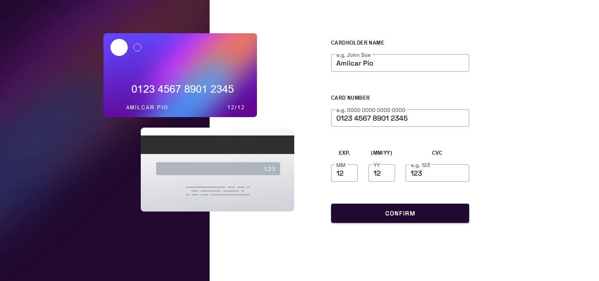
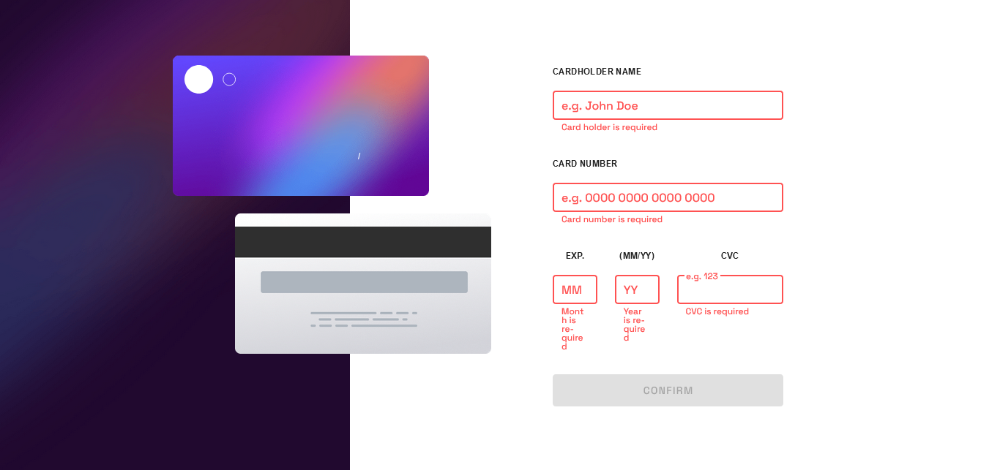
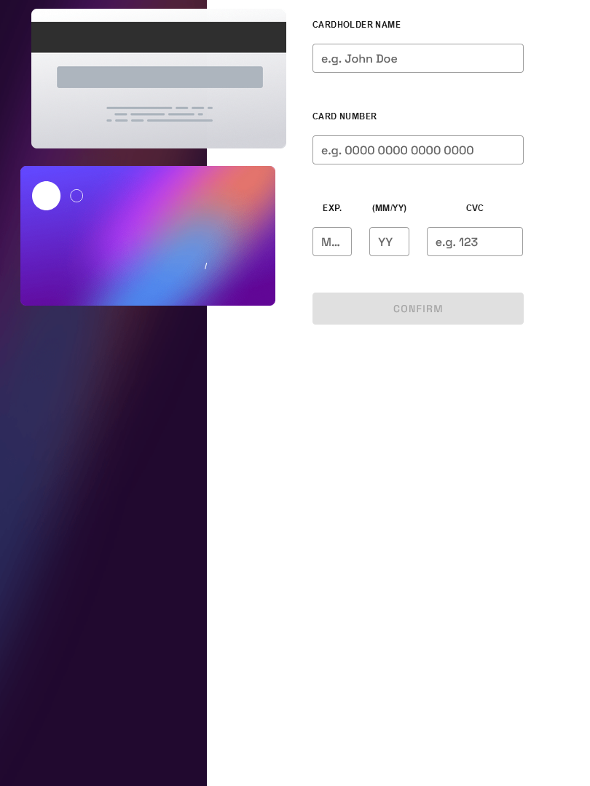
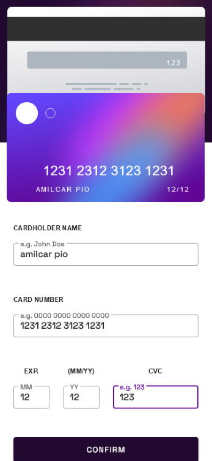

# credit-card

## Project setup
```
npm install
```

### Compiles and hot-reloads for development
```
npm run serve
```

### Compiles and minifies for production
```
npm run build
```

### Lints and fixes files
```
npm run lint
```

### Customize configuration
See [Configuration Reference](https://cli.vuejs.org/config/).

## Table of contents

- [Overview](#overview)
  - [The challenge](#the-challenge)
  - [Screenshot](#screenshot)
  - [Links](#links)
- [My process](#my-process)
  - [Built with](#built-with)
  - [What I learned](#what-i-learned)
  - [Continued development](#continued-development)
  - [Useful resources](#useful-resources)
- [Author](#author)
- [Acknowledgments](#acknowledgments)


## Overview

### The task

Users should be able to:

- Fill in the form and see the card details update in real-time
- Receive error messages when the form is submitted if:
  - Any input field is empty
  - The card number, expiry date, or CVC fields are in the wrong format
- View the optimal layout depending on their device's screen size
- See hover, active, and focus states for interactive elements on the page

### Screenshot






### Links
- Live Site URL: [Add live site URL here](https://your-live-site-url.com)

## My process

### Built with

- Semantic HTML5 markup
- CSS custom properties
- Flexbox
- CSS Grid
- Mobile-first workflow
- [Vuetify](https://vuetifyjs.com/) - Material Design
- [Vue.js](https://vuejs.org/) - Js framework

### What I learned

With this project i learned a lot about componentization and how to bind v-model data between them. I also honed my responsiveness skills. Vuetify was a good framework to build this project, and fun to work with!

```Js
updateNumber(value) {
      this.$emit("input", {
        ...this.value,
        number: value,
      });
    },
```


### Continued development

For the next projects I intend to improve the componentization even more. Also use Composition API and Vue Router


### Useful resources

- [The Net Ninja - Youtube](https://www.youtube.com/watch?v=YrxBCBibVo0&list=PL4cUxeGkcC9hYYGbV60Vq3IXYNfDk8At1&ab_channel=TheNetNinja) - This brilliant playlist helped-me a lot through all the process.
- [StackOverFlow](https://stackoverflow.com/questions/47311936/v-model-and-child-components) - This issue in stackoverflow helped me to bind the data between child and parent components.

## Author

- LinkedIn - [Amilcar Pio](https://www.linkedin.com/in/amilcarpio/)

## Acknowledgments

This project was a challenge from frontendmentor.io.
